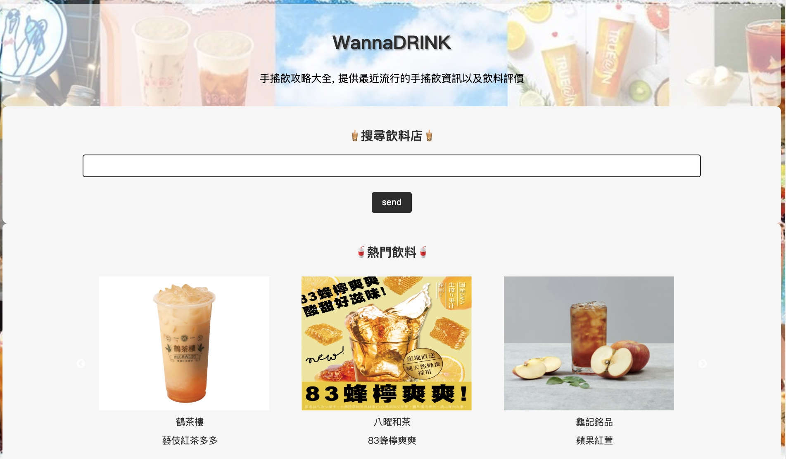
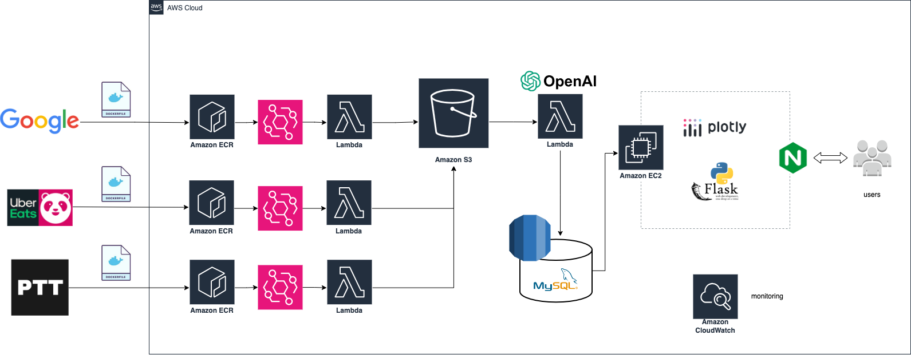
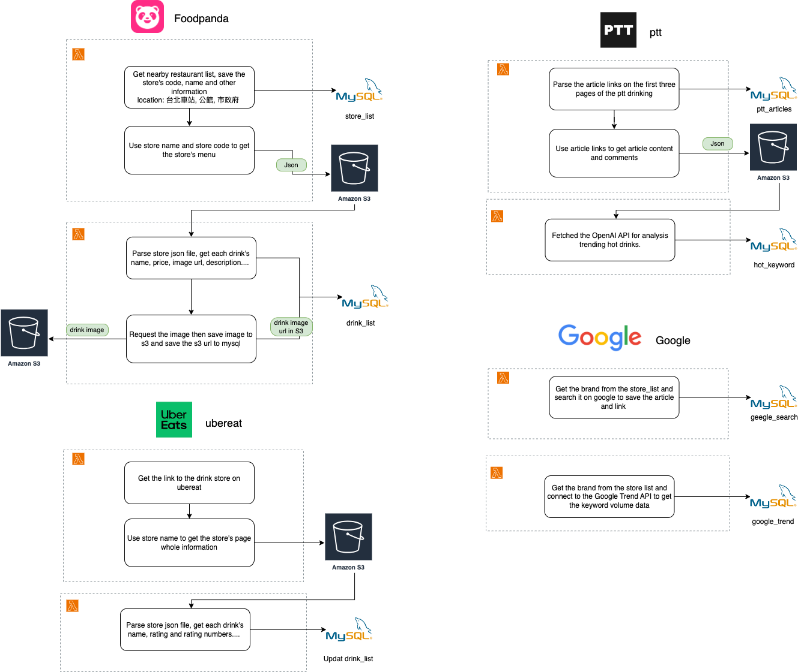
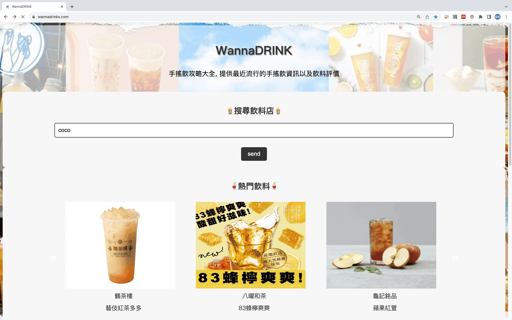
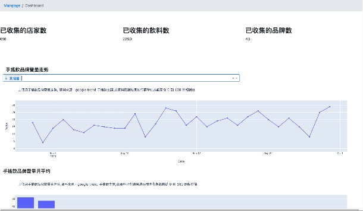

# WannaDRINK

**One stop bubble tea reviews comparison website **

### Website : https://www.wannadrinks.com/

## Server Structure

## Data Pipeline

## Features
### Boba tea search barsearchbar

### Dashboard

### Map

### Boba tea trending keywords  

## Technologies

>Cloud Service (AWS)
* AWS EC2
* AWS RDS
* AWS S3
* AWS Lambda
* AWS ECR
* AWS EventBridge
* AWS CloudWatch

> Backend
* Flask

> Database
* MySQL

> Frontend
* HTML
* CSS
* JavaScript

> Networking
* Nginx
* SSL Certificate
* Domain Name System (DNS)

> Others
* OpenAI API
* Googel Trend API
* Design Pattern: MVC
* Version Control: Git, GitHub
* Agile: Trello (Scrum)
* Test: Pytest

## Contact Me

Tracy Huang   tracy4528@gmail.com